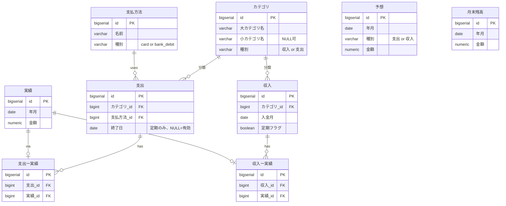

# 収支管理アプリ DBスキーマ設計書 v3

作成日: 2026-05-06
オーナー: ふりすく
関連ドキュメント: 収支管理MVP_要件定義書_v3_2.md / 収支管理MVP_インフラ設計書_v2.md
変更点: v2 を全面刷新。**「予想は月単位の合計のみ」「実績はマスタごとに記録」** のシンプル設計に変更。

---

## 1. 設計思想

### 1.1 本質的な目的
**来月以降の予想残高を知ること**が一番の目的。  
そのため:
- **予想**: 月単位の支出合計・収入合計だけを持つ (細かいカテゴリ予想はしない)
- **実績**: マスタ単位で記録 (カテゴリ別の集計は実績側で対応)

### 1.2 主要テーブルの関係

```
カテゴリ
   ↓
支出マスタ ──(支出ー実績)── 実績
                              ↑
収入マスタ ──(収入ー実績)──┘

予想 (フラット、月単位合計のみ)
月末残高 (独立)
支払方法 (支出マスタが参照)
```

### 1.3 基本方針

| 項目 | 決定内容 |
|---|---|
| DB | PostgreSQL (Supabase) |
| ORM | ActiveRecord (Rails) |
| 金額型 | `numeric(15, 0)` 整数円。Rails側は `BigDecimal` |
| 年月の表現 | `date` 型でその月の1日 (例: 2026-05-01) |
| タイムゾーン | Asia/Tokyo |
| ユーザー管理 | Supabase Auth による単一ユーザー運用。`user_id` 省略 |
| 金額の符号 | 予想・実績ともに **正=収入、負=支出** で統一 |
| 画面表示 | 金額は絶対値表示 (収支は色やラベルで区別) |

---

## 2. テーブル一覧 (全9本)

| # | テーブル名 | 種別 | 概要 |
|---|---|---|---|
| 1 | カテゴリ | マスタ | 大/小カテゴリの一元管理 (収支区別含む) |
| 2 | 支払方法 | マスタ | PayPayカード / Amazonカード / 口座引落 |
| 3 | 支出 | マスタ | 各支出の登録 (定期支出は終了日を持つ) |
| 4 | 収入 | マスタ | 各収入の登録 (入金月・一時/定期) |
| 5 | 予想 | データ | 月単位の支出合計・収入合計 |
| 6 | 実績 | データ | 個別の収支発生記録 (金額のみ) |
| 7 | 支出ー実績 | 中間 | 支出マスタ ↔ 実績 |
| 8 | 収入ー実績 | 中間 | 収入マスタ ↔ 実績 |
| 9 | 月末残高 | 独立 | みずほ口座の月末残高 (手動入力) |

---

## 3. ER図



---

## 4. テーブル定義

---

### 4.1 カテゴリ (categories)

大カテゴリ・小カテゴリをフラットに1テーブルで管理。  
ユーザーが「ソシャゲ・サブスクは細かく、食費・雑費は大雑把に」を自由に表現できる。

| カラム名 | 型 | NULL | デフォルト | 説明 |
|---|---|---|---|---|
| id | bigserial | NOT NULL | — | PK |
| 大カテゴリ名 | varchar(100) | NOT NULL | — | 例: サブスク、食費、給与 |
| 小カテゴリ名 | varchar(100) | NULL | — | 例: Netflix、Uber Eats。不要なら NULL |
| 種別 | varchar(10) | NOT NULL | — | `収入` or `支出` |
| created_at | timestamptz | NOT NULL | now() | |
| updated_at | timestamptz | NOT NULL | now() | |

**サンプルデータ:**

| id | 大カテゴリ名 | 小カテゴリ名 | 種別 |
|---|---|---|---|
| 1 | サブスク | Netflix | 支出 |
| 2 | サブスク | Spotify | 支出 |
| 3 | ソシャゲ | すたれ | 支出 |
| 4 | ソシャゲ | めいちょう | 支出 |
| 5 | 食費 | NULL | 支出 |
| 6 | 雑費 | NULL | 支出 |
| 7 | 給与 | NULL | 収入 |
| 8 | 副業 | NULL | 収入 |

---

### 4.2 支払方法 (payment_methods)

| カラム名 | 型 | NULL | デフォルト | 説明 |
|---|---|---|---|---|
| id | bigserial | NOT NULL | — | PK |
| 名前 | varchar(100) | NOT NULL | — | 表示名 |
| 種別 | varchar(20) | NOT NULL | — | `card` or `bank_debit` |
| created_at | timestamptz | NOT NULL | now() | |
| updated_at | timestamptz | NOT NULL | now() | |

**初期データ:**

| 名前 | 種別 | 残高への影響 |
|---|---|---|
| PayPayカード | card | 翌月27日まとめて引落 |
| Amazonカード | card | 翌月27日まとめて引落 |
| 口座引落 | bank_debit | 当月中に即時 |

> 現金・デビットも `bank_debit` に集約 (発生月内に口座から減るという扱いが同じため)

---

### 4.3 支出 (expenses)

支出マスタ。定期支出(Netflix等)・不定期支出(食費等)・突発購入(Amazon等)を1テーブルで管理。  
**月額は持たない**（一括編集機能で代替）。  
**引落日は持たない**（残高予測は月単位のため不要）。

| カラム名 | 型 | NULL | デフォルト | 説明 |
|---|---|---|---|---|
| id | bigserial | NOT NULL | — | PK |
| カテゴリ_id | bigint | NOT NULL | — | FK → カテゴリ (種別=支出) |
| 支払方法_id | bigint | NOT NULL | — | FK → 支払方法 |
| 終了日 | date | NULL | — | 定期支出のみ。NULL=有効中 |
| created_at | timestamptz | NOT NULL | now() | |
| updated_at | timestamptz | NOT NULL | now() | |

**動作:**
- 定期支出 (Netflix 等) は 終了日 NULL で運用、解約時に日付セット
- 不定期支出 (食費・雑費) も 終了日 NULL で運用
- 突発購入 (Amazon一時購入) も同じテーブルで管理

**UI仕様 (停止操作):**
- 「今月から停止」ボタン → `終了日 = 当月1日` をセット
- 「翌月から停止」ボタン → `終了日 = 翌月1日` をセット

---

### 4.4 収入 (incomes)

| カラム名 | 型 | NULL | デフォルト | 説明 |
|---|---|---|---|---|
| id | bigserial | NOT NULL | — | PK |
| カテゴリ_id | bigint | NOT NULL | — | FK → カテゴリ (種別=収入) |
| 入金月 | date | NOT NULL | — | 月単位 (date型で月初日) |
| 定期フラグ | boolean | NOT NULL | true | true=毎月入金、false=一時のみ |
| created_at | timestamptz | NOT NULL | now() | |
| updated_at | timestamptz | NOT NULL | now() | |

**動作:**
- 給与 (定期フラグ true) → 毎月発生
- 賞与 (定期フラグ false) → その月だけ発生

---

### 4.5 予想 (forecasts)

**月単位の支出合計・収入合計**だけを持つフラットなテーブル。

| カラム名 | 型 | NULL | デフォルト | 説明 |
|---|---|---|---|---|
| id | bigserial | NOT NULL | — | PK |
| 年月 | date | NOT NULL | — | 対象年月 (月初日) |
| 種別 | varchar(10) | NOT NULL | — | `支出` or `収入` |
| 金額 | numeric(15,0) | NOT NULL | — | 正=収入、負=支出 |
| created_at | timestamptz | NOT NULL | now() | |
| updated_at | timestamptz | NOT NULL | now() | |

**UNIQUE:** `(年月, 種別)` 1月につき支出1レコード + 収入1レコードの計2レコード

**サンプルデータ:**

| 年月 | 種別 | 金額 |
|---|---|---|
| 2026-05-01 | 支出 | -200,000 |
| 2026-05-01 | 収入 | +350,000 |
| 2026-06-01 | 支出 | -200,000 |
| 2026-06-01 | 収入 | +350,000 |

**動作:**
- 年度初め (4月) にバッチで12ヶ月分のレコードを生成 (前年度実績や手動入力ベース)
- 詳細編集画面で月別に金額を上書き可能
- 「一括で今月以降を編集」機能で複数月を一気に更新可

---

### 4.6 実績 (actuals)

個別の収支発生記録。**金額だけ**を持つ最小構造。  
紐付くマスタは中間テーブルで決まる。

| カラム名 | 型 | NULL | デフォルト | 説明 |
|---|---|---|---|---|
| id | bigserial | NOT NULL | — | PK |
| 年月 | date | NOT NULL | — | 月単位 (月初日) |
| 金額 | numeric(15,0) | NOT NULL | — | 正=収入、負=支出 |
| created_at | timestamptz | NOT NULL | now() | |
| updated_at | timestamptz | NOT NULL | now() | |

**バリデーション (アプリ層):**
- 1レコードに対し 支出ー実績 / 収入ー実績 のいずれか **1つだけ** が紐付く
- 金額が正なら 収入ー実績、負なら 支出ー実績

**カテゴリ別集計 (重要):**
```sql
-- 例: 2026年5月のカテゴリ別支出合計
SELECT c.大カテゴリ名, c.小カテゴリ名, SUM(a.金額)
FROM 実績 a
JOIN 支出ー実績 ee ON ee.実績_id = a.id
JOIN 支出 e ON e.id = ee.支出_id
JOIN カテゴリ c ON c.id = e.カテゴリ_id
WHERE a.年月 = '2026-05-01'
GROUP BY c.id;
```

---

### 4.7 支出ー実績 (expense_actuals)

| カラム名 | 型 | NULL | デフォルト | 説明 |
|---|---|---|---|---|
| id | bigserial | NOT NULL | — | PK |
| 支出_id | bigint | NOT NULL | — | FK → 支出 |
| 実績_id | bigint | NOT NULL | — | FK → 実績 |
| created_at | timestamptz | NOT NULL | now() | |

**UNIQUE:** `実績_id` (1実績は1中間レコードのみ)

---

### 4.8 収入ー実績 (income_actuals)

| カラム名 | 型 | NULL | デフォルト | 説明 |
|---|---|---|---|---|
| id | bigserial | NOT NULL | — | PK |
| 収入_id | bigint | NOT NULL | — | FK → 収入 |
| 実績_id | bigint | NOT NULL | — | FK → 実績 |
| created_at | timestamptz | NOT NULL | now() | |

**UNIQUE:** `実績_id`

---

### 4.9 月末残高 (monthly_balances)

| カラム名 | 型 | NULL | デフォルト | 説明 |
|---|---|---|---|---|
| id | bigserial | NOT NULL | — | PK |
| 年月 | date | NOT NULL | — | 対象年月 (月初日) |
| 金額 | numeric(15,0) | NOT NULL | — | 月末実残高 (手動入力) |
| created_at | timestamptz | NOT NULL | now() | |
| updated_at | timestamptz | NOT NULL | now() | |

**UNIQUE:** `年月`

---

## 5. インデックス設計

| テーブル | カラム | 種別 | 目的 |
|---|---|---|---|
| カテゴリ | (大カテゴリ名, 小カテゴリ名) | UNIQUE INDEX | 重複防止 |
| 支出 | カテゴリ_id | INDEX | カテゴリ別集計 |
| 支出 | 支払方法_id | INDEX | 支払方法別集計 |
| 支出 | 終了日 | INDEX | 有効/無効フィルタ |
| 収入 | カテゴリ_id | INDEX | カテゴリ別集計 |
| 予想 | (年月, 種別) | UNIQUE INDEX | 月単位重複防止 |
| 実績 | 年月 | INDEX | 月別絞り込み |
| 支出ー実績 | 実績_id | UNIQUE INDEX | 1-1ルール担保 |
| 支出ー実績 | 支出_id | INDEX | 支出別集計 |
| 収入ー実績 | 実績_id | UNIQUE INDEX | 1-1ルール担保 |
| 収入ー実績 | 収入_id | INDEX | 収入別集計 |
| 月末残高 | 年月 | UNIQUE INDEX | 重複防止 |

---

## 6. 残高予測計算

```
当月末予測残高 = 前月末の月末残高
  + 当月の収入  (実績合計があればそれ、なければ予想.種別=収入)
  + 当月の支出  (実績合計があればそれ、なければ予想.種別=支出)

※ 予想・実績ともに金額の符号で収支区別 (+収入 / -支出) なので
   そのまま SUM すれば残高計算が成立する
```

### 重要: カード引落タイミングの扱い

要件定義§5.3 では「カード利用は翌月27日に引落」とされていたが、本設計では**月単位の予測**に簡略化。  
カード分も発生月の支出として記録される。

> 厳密な日次キャッシュフロー予測が必要になったら、実績テーブルに `決済予定月` カラムを追加して再計算する余地を残す。

---

## 7. 機能要件カバレッジ

| F# | 機能 | カバー方法 |
|---|---|---|
| F-01 | 収入カテゴリ管理 | カテゴリ (種別=収入) CRUD |
| F-02 | 収入予測管理 | 予想 (種別=収入) で月単位 |
| F-03 | 収入実績管理 | 実績 + 収入ー実績 |
| F-04 | 収入予/実切替表示 | 集計時にロジックで判定 |
| F-05 | 期限なし定期マスタ | 支出 (終了日 NULL で運用) |
| F-06 | 引落日チェック&自動実績化 | **削除**: 月単位管理のため自動生成バッチ不要 |
| F-07 | サブスクマスタ | 支出 (カテゴリ=サブスク + 終了日管理) |
| F-08 | 更新日チェック&自動実績化 | F-06と同様、不要 |
| F-09 | サブスク一覧画面 | 支出 WHERE カテゴリ.大カテゴリ名='サブスク' |
| F-10 | 大/詳細カテゴリ | カテゴリ.大カテゴリ名 + 小カテゴリ名 |
| F-11 | 単発予測管理 | 予想 (種別=支出) で月単位 |
| F-12 | 単発実績管理 | 実績 + 支出ー実績 |
| F-13 | 単発予/実切替表示 | 集計時にロジックで判定 |
| F-14 | 直近Nヶ月平均で初期化 | 年度初めバッチで12ヶ月分の予想を生成 |
| F-15 | 月末残高入力 | 月末残高 |
| F-16 | 支払方法管理 | 支払方法マスタ |
| F-17 | データインポート | 実績 + 中間テーブル一括投入 |
| F-18 | 手動入力・編集 | 実績 直接 CRUD |
| F-19 | 支払日ベース残高予測 | §6 計算式参照 (月単位に簡略化) |
| F-20 | 月末残高の予実表示 | 月末残高 |
| F-21 | カテゴリ別集計 | 実績 → 中間 → 支出/収入 → カテゴリ で集計 |
| F-22 | カード別分析 (△) | 実績 → 中間 → 支出 → 支払方法 で集計 |
| F-23〜F-26 | 取込み | 実績 一括投入で対応 |

> **F-06/F-08 は本設計では不要**: 月単位管理のため、定期支出の自動実績化が不要 (実績テーブルへの登録もユーザー操作 or インポートで完結)

---

## 8. 設計上の判断メモ

### 予想を「月単位の合計」に簡略化した理由
- ユーザーの本質的な目的は「来月以降の予想残高を知ること」
- カテゴリ別の細かい予想は精度向上のための副次的なもので、平均でならしても問題ない
- 簡略化により中間テーブル (支出ー予想 / 収入ー予想) を廃止 → テーブル数削減

### 実績を1テーブルに集約した理由
- 残高計算は `実績.金額` の SUM で完結 (符号で収支区別)
- カテゴリ別集計も中間テーブル経由で柔軟に対応
- インポート時のレコード生成がシンプル

### 支出から「月額」「引落日」を削除した理由
- 月額: 予想テーブルが月単位の値を持つので不要 (一括編集機能で代替)
- 引落日: 月単位予測のため不要 (要件定義§2.3 「日次の残高推移管理は対象外」)

### 支払方法をマスタ化した理由
- 残高予測ロジックで `card / bank_debit` の種別判定が必要
- カード別分析 (F-22) も支払方法.名前で集計可能
- enum よりマスタ化の方が拡張性が高い (将来 `paypay_balance` 等の追加が容易)

### 1-1ルールはアプリ層で担保
- 1つの実績は 支出ー実績 / 収入ー実績 のどちらか1つだけに紐付く
- DB レベルでは UNIQUE 制約で重複防止のみ

---

## 9. 残課題・未決事項

| # | 項目 | 優先度 | 備考 |
|---|---|---|---|
| S-01 | 年度初めの予想自動生成バッチ仕様 | 中 | 4月1日に12ヶ月分の予想レコードを生成 |
| S-02 | 一括編集機能の仕様 | 中 | 「今月以降を一律¥XXに変更」UI |
| S-03 | インポートフォーマット仕様 | 高 | 要件定義 O-05 |
| S-04 | カード引落の月またぎ問題 | 低 | 必要になったら 決済予定月 カラム追加 |
| S-05 | 投資・貯金口座への振替記録 | 低 | みずほ残高だけでは貯蓄全体が見えない (将来フェーズ) |

---

## 10. 変更履歴

| バージョン | 日付 | 変更内容 |
|---|---|---|
| v1 | 2026-05-06 | 初版作成 |
| v2 | 2026-05-06 | 取引履歴 + 取引計画 中心の中間テーブル方式に再設計 |
| v3 | 2026-05-06 | **「予想は月単位合計のみ、実績はマスタ単位」のシンプル設計に再構成。テーブル数9本に整理** |
