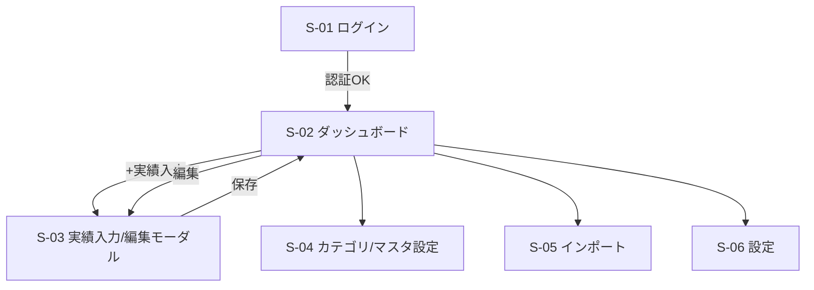

# 収支管理アプリ UI/UX 設計書 v2

作成日: 2026-05-06
オーナー: ふりすく
関連ドキュメント: 収支管理MVP_要件定義書_v3_2.md / 収支管理MVP_インフラ設計書_v2.md / 収支管理MVP_DBスキーマ設計書_v3.md
変更点: DB v3(予想は月単位合計、実績はカテゴリ別集計)に合わせて画面構成を再設計。ダッシュボード中心に集約。

---

## 1. 設計方針

### 1.1 基本コンセプト
- **目的優先**: 来月以降の予想残高を最短で把握できるUI
- **ダッシュボード中心**: 予想確認・実績入力・月末残高入力・インポート導線を1画面に集約
- **月単位運用**: 日次管理は行わず、年月単位で編集
- **金額は絶対値表示**: 符号は内部ロジックのみで利用し、画面ではラベル/色で区別

### 1.2 UX原則
- 操作回数最小: 主要操作は2〜3タップで完了
- 迷わない導線: 入力/編集はモーダルで統一
- 意味のある詳細のみ表示: 予想は全体、実績はカテゴリ別詳細

### 1.3 対応デバイス
- PWA (PC / スマホ)
- PC: 2カラムで情報密度重視
- スマホ: 縦スクロール + FABで入力開始

---

## 2. 画面一覧 (v2)

| # | 画面名 | パス | 用途 | 優先度 |
|---|---|---|---|---|
| S-01 | ログイン | `/login` | Google OAuth | MVP |
| S-02 | ダッシュボード | `/` | 予想残高、今年度サマリ表、実績集計、今月残高入力 | MVP |
| S-03 | 実績入力/編集モーダル | (モーダル) | 実績の手動追加・修正・削除 | MVP |
| S-04 | カテゴリ/マスタ設定 | `/masters` | カテゴリ、支出、収入、支払方法のCRUD | MVP |
| S-05 | インポート | `/import` | JSON/CSVの取込 | MVP |
| S-06 | 設定 | `/settings` | 将来拡張用 (任意) | △ |

> 旧 `取引履歴一覧` / `取引計画一覧` / `月末残高入力` は廃止し、ダッシュボードへ統合。

---

## 3. 画面遷移図



---

## 4. ダッシュボード (S-02)

### 4.1 情報構成
1. 今月の予想残高カード
2. 今月の収入/支出サマリ (予想 vs 実績)
3. **今年度サマリ表 (4月〜翌3月)**
4. カテゴリ別実績一覧 (支出/収入)
5. 今月の月末残高入力フォーム
6. クイックアクション (実績追加 / インポート / マスタ設定)

### 4.2 ワイヤー (PC)

```
┌──────────────────────────────────────────────────────────────┐
│ < 2026年5月 >                                  [今月] [取込] │
├──────────────────────────────────────────────────────────────┤
│ 月末予想残高 ¥2,345,678 (予)   前月比 +¥123,456              │
│ 収入: 予¥350,000 / 実¥320,000   支出: 予¥200,000 / 実¥180,000 │
├──────────────────────────────────────────────────────────────┤
│ 今年度サマリ (2026/04〜2027/03)                               │
│ 月   収入(予/実)   支出(予/実)   月末残高   状態              │
│ 4月  350/340       200/190      2,220,000 実                 │
│ 5月  350/320       200/180      2,345,678 予                 │
│ ...                                                            │
├──────────────────────────────────────────────────────────────┤
│ カテゴリ別実績 (当月)                                          │
│ [支出] ソシャゲ 20,000 / サブスク 5,470 / 食費 45,000 ...     │
│ [収入] 給与 320,000 / 副業 0 ...                              │
│ 各行 [詳細] [編集] [実績追加]                                  │
├──────────────────────────────────────────────────────────────┤
│ 今月の月末残高入力: ¥[          ] [保存]                       │
│ [+実績入力] [カテゴリ設定] [インポート]                        │
└──────────────────────────────────────────────────────────────┘
```

### 4.3 ワイヤー (スマホ)

```
┌────────────────────────────┐
│ < 2026/05 >      [取込]    │
├────────────────────────────┤
│ 月末予想残高 ¥2,345,678    │
│ 収入 予/実 350,000/320,000 │
│ 支出 予/実 200,000/180,000 │
├────────────────────────────┤
│ 今年度サマリ表 (横スクロール)│
├────────────────────────────┤
│ カテゴリ別実績(当月)        │
│ ソシャゲ 20,000 [詳細]      │
│ 食費     45,000 [詳細]      │
├────────────────────────────┤
│ 今月の月末残高 [      ] [保存]│
└────────────────────────────┘
         [+]  (実績追加FAB)
```

### 4.4 今年度サマリ表仕様
- 期間: 会計年度 (4月〜翌3月)
- 行: 月
- 列:
  - 収入(予想)
  - 収入(実績)
  - 支出(予想)
  - 支出(実績)
  - 月末残高 (実 or 予)
  - 状態 (実/予のラベル)
- 状態表現:
  - 実: グレーラベル
  - 予: ブルーラベル

---

## 5. 実績入力/編集モーダル (S-03)

### 5.1 フォーム項目
- 年月 (デフォルト: 表示中の月)
- 種別 (支出 / 収入)
- 金額 (入力は正値、保存時に符号変換)
- 対象マスタ
  - 支出: `支出`テーブルから選択
  - 収入: `収入`テーブルから選択

### 5.2 ワイヤー

```
┌──────────────────────────┐
│ 実績を追加               │
├──────────────────────────┤
│ 年月      [2026-05 ▼]    │
│ 種別      [支出 ▼]       │
│ 金額      [  3500 ]      │
│ 対象      [食費 ▼]       │
│                          │
│ [キャンセル] [保存]      │
└──────────────────────────┘
```

### 5.3 挙動
- 保存時変換:
  - 支出 → `実績.金額 = -入力値`
  - 収入 → `実績.金額 = +入力値`
- 中間テーブル自動作成:
  - 支出なら `支出ー実績`
  - 収入なら `収入ー実績`
- 編集時は既存値を初期表示

---

## 6. カテゴリ/マスタ設定 (S-04)

### 6.1 画面内セクション
1. カテゴリ管理 (`カテゴリ`)
2. 支払方法管理 (`支払方法`)
3. 支出管理 (`支出`)
4. 収入管理 (`収入`)

### 6.2 主要項目
- カテゴリ: 大カテゴリ名 / 小カテゴリ名 / 種別
- 支払方法: 名前 / 種別(card or bank_debit)
- 支出: カテゴリ / 支払方法 / 終了日
- 収入: カテゴリ / 入金月 / 定期フラグ

### 6.3 補助UI
- 定期支出停止ボタン:
  - 今月から停止
  - 翌月から停止

---

## 7. インポート (S-05)

### 7.1 入力方式
- JSON貼り付け
- CSVアップロード

### 7.2 処理フロー
1. パース
2. バリデーション (年月・種別・対象・金額)
3. プレビュー
4. 一括保存

### 7.3 保存先
- `実績`
- `支出ー実績` or `収入ー実績`

---

## 8. ナビゲーション設計

### 8.1 PC
```
[ロゴ] ダッシュボード | マスタ設定 | インポート | 設定
```

### 8.2 スマホ
- ボトムナビ:
  - ダッシュボード
  - マスタ設定
  - インポート
  - 設定
- 右下FAB:
  - 実績追加モーダルを開く

---

## 9. APIエンドポイント (DB v3準拠)

### 9.1 ダッシュボード
| Method | Path | 用途 |
|---|---|---|
| GET | `/api/dashboard?year_month=2026-05` | 予想残高・今年度表・カテゴリ別実績を一括取得 |

### 9.2 予想
| Method | Path | 用途 |
|---|---|---|
| GET | `/api/forecasts?year_month=2026-05` | 当月予想取得(収入/支出) |
| PATCH | `/api/forecasts/:id` | 予想更新 |
| POST | `/api/forecasts/bulk_update` | 今月以降の一括編集 |

### 9.3 実績
| Method | Path | 用途 |
|---|---|---|
| GET | `/api/actuals?year_month=2026-05` | 実績一覧 |
| POST | `/api/actuals` | 実績作成(中間テーブルも同時処理) |
| PATCH | `/api/actuals/:id` | 実績編集 |
| DELETE | `/api/actuals/:id` | 実績削除 |
| POST | `/api/actuals/import` | 実績一括取込 |

### 9.4 マスタ
| Method | Path | 用途 |
|---|---|---|
| GET/POST/PATCH/DELETE | `/api/categories` | カテゴリCRUD |
| GET/POST/PATCH/DELETE | `/api/payment_methods` | 支払方法CRUD |
| GET/POST/PATCH/DELETE | `/api/expenses` | 支出CRUD |
| GET/POST/PATCH/DELETE | `/api/incomes` | 収入CRUD |

### 9.5 月末残高
| Method | Path | 用途 |
|---|---|---|
| GET/PUT | `/api/monthly_balances?year_month=2026-05` | 今月の月末残高取得/更新 |

---

## 10. 機能要件カバレッジ (DB v3前提)

| F# | 対応 | 備考 |
|---|---|---|
| F-01 | S-04 | 収入カテゴリCRUD |
| F-02 | S-02 | 月単位収入予想編集 |
| F-03 | S-03 | 収入実績入力 |
| F-04 | S-02 | 予/実の比較表示 |
| F-05 | S-04 | 支出管理で対応 |
| F-06 | 非対応(設計簡略化) | DB v3方針で除外 |
| F-07 | S-04 | サブスクカテゴリで対応 |
| F-08 | 非対応(設計簡略化) | DB v3方針で除外 |
| F-09 | S-02/S-04 | サブスクカテゴリ集計 |
| F-10 | S-04 | 大/小カテゴリ管理 |
| F-11 | S-02 | 月単位支出予想編集 |
| F-12 | S-03 | 単発実績入力 |
| F-13 | S-02 | 予/実切替表示 |
| F-14 | バッチ/API | 年度初め12ヶ月生成 |
| F-15 | S-02 | 今月残高入力を統合 |
| F-16 | S-04 | 支払方法管理 |
| F-17 | S-05 | インポート |
| F-18 | S-03 | 手動入力編集 |
| F-19 | S-02 | 月次予測計算 |
| F-20 | S-02 | 月末残高の実/予表示 |
| F-21 | S-02 | カテゴリ別集計 |
| F-22 | S-02 | 支払方法別集計(余裕があれば) |
| F-23〜26 | S-05 | 取込系 |

---

## 11. 未決事項

| # | 項目 | 優先度 | 備考 |
|---|---|---|---|
| U-01 | ダッシュボードのテーブル行数上限 | 中 | スマホでの視認性調整 |
| U-02 | 予想の一括編集UI詳細 | 中 | 差分適用か固定値上書きか |
| U-03 | インポートエラーメッセージ仕様 | 高 | 行番号付き表示 |
| U-04 | 非対応要件(F-06/F-08)の扱い方針 | 高 | 要件書との差分明記 |

---

## 12. 変更履歴

| バージョン | 日付 | 変更内容 |
|---|---|---|
| v1 | 2026-05-06 | 初版作成。11画面中心 |
| v2 | 2026-05-06 | DB v3に合わせて再設計。ダッシュボード中心の6画面へ集約、今年度サマリ表と今月残高入力を統合 |
