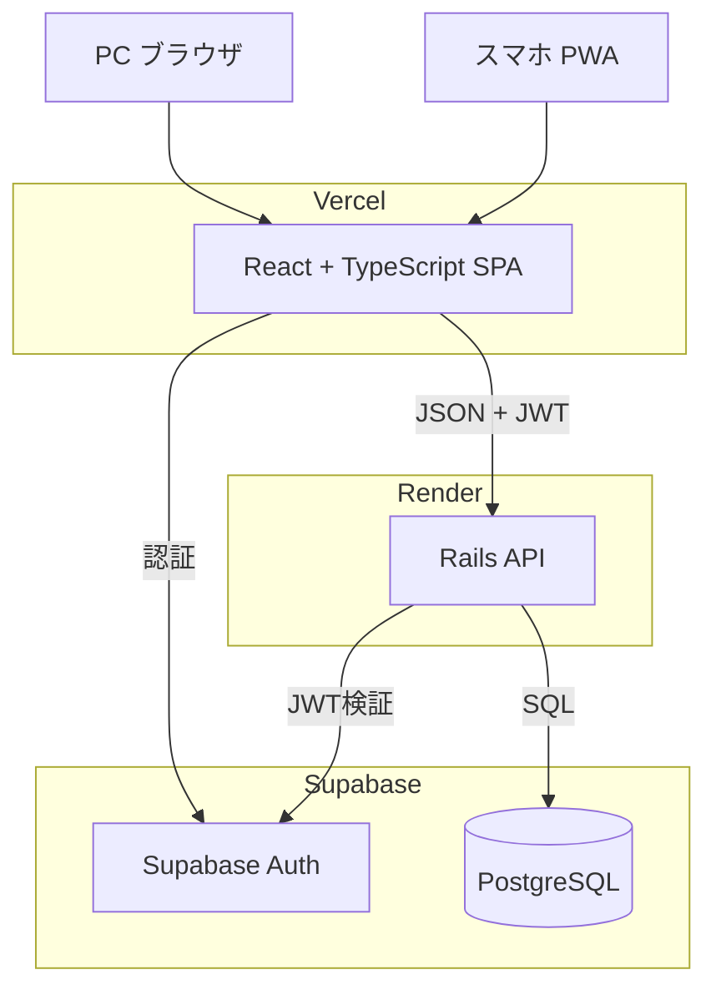
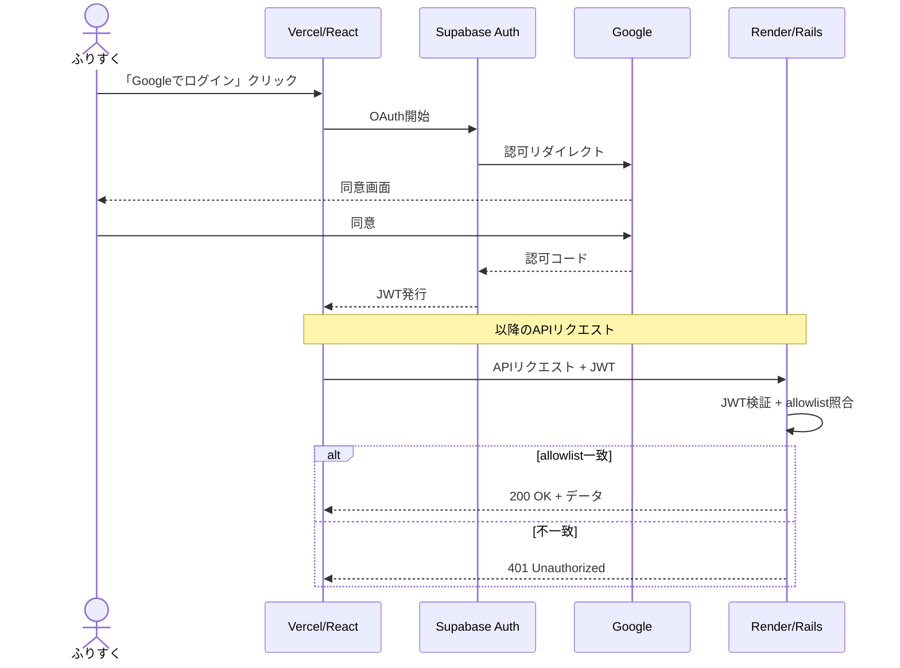
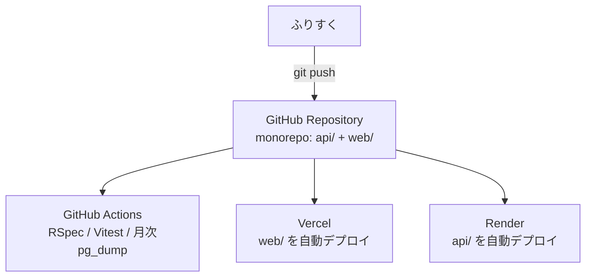

# 収支管理アプリ インフラ設計書 v2

作成日: 2026-05-06
オーナー: ふりすく
関連ドキュメント: 収支管理MVP_要件定義書_v3_2.md
変更点: 認証方式を Supabase Auth (Google OAuth) に確定。メールallowlistによる単一ユーザー運用を追加。未決事項I-01〜I-06を全て確定事項に昇格。

---

## 1. 全体方針

| 項目 | 決定内容 |
|---|---|
| プラットフォーム | PWA(PC・スマホ両対応、単一コードベース) |
| Backend | Ruby on Rails(API モード) |
| Frontend | React + TypeScript(Vite想定) |
| Database | PostgreSQL |
| 認証 | Supabase Auth(Google OAuth)+ Rails側でメールallowlist |
| ソース管理 | GitHub(monorepo) |
| CI/CD | GitHub Actions + 各ホスティングのGitHub連携による自動デプロイ |

---

## 2. ランタイム構成(本番)

### 2.1 構成説明
- ユーザーは PC ブラウザまたはスマホ(PWA)から Vercel にアクセス
- Vercel は静的アセットとしてビルド済み React SPA を配信
- React がログイン時は Supabase Auth と直接やり取り、データ操作時は JWT を添えて Rails API を呼び出す
- Rails は受け取った JWT を Supabase の公開鍵で検証してから処理を行い、Supabase の PostgreSQL に読み書き

### 2.2 注意点
- Vercel と Render は別ドメインのため、Rails 側で **CORS 設定が必須**
- 金額計算は Rails 側で `BigDecimal`、PostgreSQL側で `numeric` 型を使用(Float禁止)
- Supabase Auth が認証を担うため、Rails側はユーザーテーブル不要(必要なら `supabase_user_id` を外部キーとして保持)

---

## 3. 認証フロー

### 3.1 シーケンス図

### 3.2 メールアドレス allowlist
- ふりすく本人のGmailアドレスのみログイン可能とする運用ポリシー
- **実装**: Rails の JWT検証ミドルウェアで、JWT の `email` クレームが環境変数 `ALLOWED_EMAILS`(カンマ区切り)に含まれる場合のみリクエストを通す
- 不一致の場合は API が 401 を返却 → フロント側で「アクセス権限がありません」と表示
- **将来の拡張性**: 環境変数で管理しているため、複数人運用に切り替える際もコード変更不要(環境変数に追加するだけ)

### 3.3 必要な環境変数

| 変数名 | 配置 | 用途 |
|---|---|---|
| `SUPABASE_URL` | Vercel / Render | Supabase プロジェクトのURL |
| `SUPABASE_ANON_KEY` | Vercel | フロントエンドからの匿名アクセス用キー |
| `SUPABASE_JWT_SECRET` | Render | Rails側でJWT署名検証に使用 |
| `ALLOWED_EMAILS` | Render | ログイン許可メールアドレス(カンマ区切り) |
| `DATABASE_URL` | Render | Supabase PostgreSQL 接続文字列 |

### 3.4 Supabase 側の設定
- Authentication > Providers で **Google を有効化**
- Google Cloud Console で OAuth クライアントID/シークレットを発行し、Supabaseに登録
- Authorized redirect URI: `https://<project>.supabase.co/auth/v1/callback`

---

## 4. CI/CD パイプライン

### 4.1 動作説明
- monorepo構成: `api/` (Rails) と `web/` (React) を1リポジトリで管理
- Vercel・Render とも `rootDirectory` 指定で対象サブディレクトリのみビルド
- `git push` 1回で、3つのジョブ(Actions / Vercel / Render)が**並行**で起動
- 各ジョブはお互いを知らないため、**テストが落ちてもデプロイは止まらない**(MVP想定)

### 4.2 環境戦略
- **本番環境**: `main` ブランチに push されたものが Vercel / Render に自動反映
- **ローカル開発**: Docker でPostgresを立てて開発(Supabase はローカル開発用プロジェクトを別途作成)
- **ステージング相当**: Vercel / Render の **PR Preview 機能**を活用(別環境を立てない)

### 4.3 将来のテストゲート化
本番事故を避けたくなったら以下に変更:
- Render の自動デプロイトリガをOFF
- GitHub Actions のワークフロー末尾で Render API を叩いてデプロイをキック
- これでテスト通過時のみデプロイされる構成になる

### 4.4 バックアップワークフロー
- GitHub Actions の `schedule` トリガで月1回 `pg_dump` を実行
- ダンプファイルを Google Drive にアップロード(または別のプライベートリポジトリに格納)
- Supabase Free にはバックアップ機能がないため、自前で月次スナップショットを確保する方針

---

## 5. サービス一覧と料金

| 項目 | サービス | プラン | 料金 | 備考 |
|---|---|---|---|---|
| Frontend | Vercel | Hobby | $0 | 個人利用は無料枠で十分 |
| Backend | Render | Free | $0 | 15分無アクセスでスリープ、起床に30〜60秒 |
| Backend | Render | Starter | $7/月 | スリープせず常時起動(快適) |
| DB / Auth | Supabase | Free | $0 | 500MB DB / 5GBストレージ / Auth無制限 |
| Source | GitHub | Free | $0 | プライベートリポジトリ無制限 |
| CI | GitHub Actions | Free | $0 | プライベートでも月2,000分無料 |
| ドメイン | (取得しない) | - | $0 | `.vercel.app` の標準ドメインを使用 |
| 監視 | Render / Vercel 標準ログ | - | $0 | Sentryはバッチ実装時に再検討 |

- **最安構成: $0/月**(Render Free のスリープ許容)
- **快適構成: $7/月**(Render Starter のみ課金、起動待ちなし)

---

## 6. 確定事項サマリ

v1 で未決だった項目を全て確定。

| # | 項目 | 決定 |
|---|---|---|
| I-01 | リポジトリ構成 | monorepo(`api/` + `web/` を1リポに) |
| I-02 | 認証方式 | Supabase Auth(Google OAuth)+ Rails側でJWT検証&メールallowlist |
| I-03 | 環境分離 | 本番 + ローカル開発の2環境(ステージングはPR Preview機能で代替) |
| I-04 | カスタムドメイン | 取得しない(`.vercel.app` 標準ドメインを使用) |
| I-05 | 監視・ログ | Render / Vercel 標準ログのみ(バッチ機能実装時にSentry再検討) |
| I-06 | バックアップ | Supabase 標準 + GitHub Actions で月1回 `pg_dump` を Google Drive へ |

---

## 7. 変更履歴

| バージョン | 日付 | 変更内容 |
|---|---|---|
| v1 | 2026-05-06 | 初版作成。Vercel + Render + Supabase + GitHub Actions 構成を採用 |
| v2 | 2026-05-06 | 認証を Supabase Auth(Google OAuth)+ メールallowlistに確定。monorepo構成、環境戦略、バックアップ方針を明文化。未決事項I-01〜I-06を全て確定事項に昇格。 |
